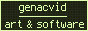

### welcome to the official github page of EV3

  

### i'm a jack of all trades . . . master of none . . . doing whatever the hell comes in my mind...

#### go check my github repos or maybe my other stuff on other sites, which are down below:

#### I also have Zandronum and ZDoom forum accounts. They're both named VL2M STUDIO
#### If you see other accounts with the names EV3, EV3lindaboi, VL2M STUDIO, veganlies2me, EvelinDaBoi, or The Explosives Factory, either it's an account that I use and that I simply didn't mention here (I have a twitch account), an account that I have abandoned (such as the Instagram account), or a fake

###### buttons made with hekate2's button maker

#### if you want to contact me you can send me a discord message @evelindaboi or an email @vl2mstudio@proton.me

## ADS BUT COOL:

